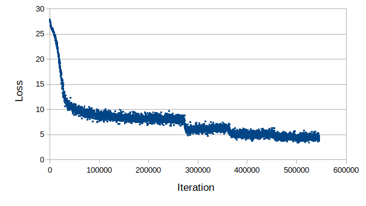
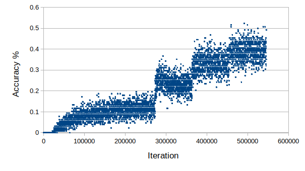

# MobileFaceNet_Tutorial_Pytorch
This repo illustrates how to implement MobileFaceNet and Arcface for face recognition task.  Don't forget to star the repo if it is helpful for your research !
## Demo

## Test
### Test Picture
  ```
  python MTCNN_MobileFaceNet.py -img {image_path}
  ```
### Take Picture for face database
1. From cam
  ```
  python take_picture.py -n {name}
  ```   
2. From photo
  ```
  python take_ID.py -i {image_path} -n {name}
  ```
### Test Video
1. From cam
  ```
  python cam_demo.py
  ```
2. From video file
  ```
  python video_demo.py
  ```
### Instruction 
  ```
  MobileFaceNet_Step_by_Step.ipynb
  ```
## Train
Download training and evaluation data from [Model Zoo](https://github.com/deepinsight/insightface/wiki/Dataset-Zoo).
Put images and annotation files into "data_set" folder. The structure should be arranged as follows:
  ```
  data_set/
              ---> AgeDB-30
              ---> CASIA_Webface_Image
              ---> CFP-FP
              ---> faces_emore_images
              ---> LFW
  ```
### Convert .bin and .rec file to images 
  ```
  python load_images_from_bin.py
  ```
### Generate annotation file 
  ```
  python anno_generation.py
  ```
### Train MobileFaceNet
  ```
  python Train.py
  ```
The training results are shown below:
<table><tr>
<td>  </td>
<td>  </td>
</tr></table>

## Evaluation 
  ```
  python Evaluation.py
  ``` 
Here is the evaluation result. 'Flip' the image can be applied to encode the embedding feature vector with ~ 0.07% higer accuracy. L2 distance score slightly outperforms cos similarity (not necessarily the same trend for other cases, but it is what we conclude in this work) 

|  Eval Type     |   Score   |   LFW   | AgeDB-30 | CFP-FP 
|:--------------:|:---------:|:-------:|:--------:|:-------
|Flip            |  L2       |  99.52  |   96.30  |  92.93    
|Flip            |  Cos      |  99.50  |   96.18  |  92.84   
|UnFlip          |  L2       |  99.45  |   95.63  |  93.10   
|UnFlip          |  Cos      |  99.45  |   95.65  |  93.10 
